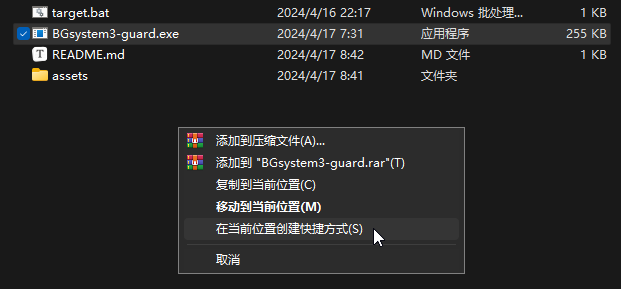
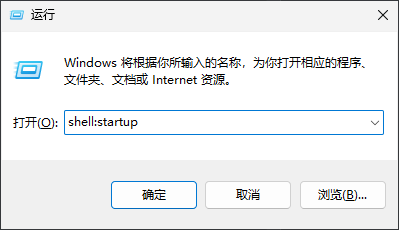
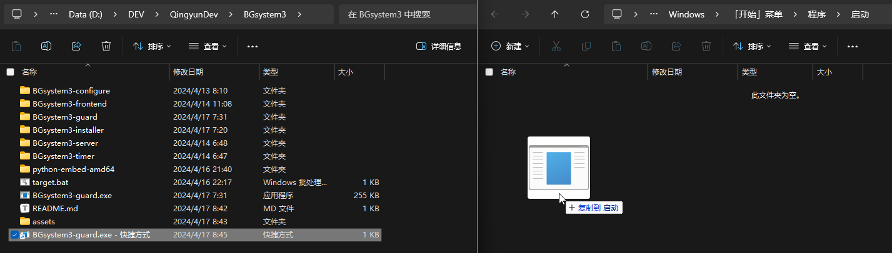

# BGsystem3

Background System 3：一个让教室内智慧大屏更有用的工具。

在你的大屏背景上添加时间、课表、值日表、考试倒计时等工具。

## 安装

### 前端安装

1. 创建`./BGsystem3-guard.exe`的快捷方式（右键拖拽）

2. <code>Win + R</code>，键入 `shell:startup` 并回车

3. 将快捷方式复制（拖入）打开的文件夹内

4. 重启电脑

通过以上步骤，BGsystem3 前端将会在开机时自动运行。

### 前端配置

配置文件位置：[`./BGsystem3-server/config/default.json`](./BGsystem3-server/config/default.json)

配置格式：<https://github.com/ShierCoding/BGsystem3-frontend/blob/master/src/core/conf/type.ts#L15-L277>

可以通过邮箱联系我们，我们可以协助定制：<zjh@shanghaiit.com>

### 后端安装

后端推荐使用 [Sucrose](https://github.com/Taiizor/Sucrose)（推荐版本：[Sucrose_Bundle_.NET_8.0_x64_24.8.8.0.exe](https://github.com/Taiizor/Sucrose/releases/download/v24.8.8.0/Sucrose_Bundle_.NET_8.0_x64_24.8.8.0.exe)）

安装前需下载依赖：

+ [.NET框架](https://dotnet.microsoft.com/zh-cn/download)（Sucrose 会自动检测框架是否安装，若未安装则会提示下载）
+ [Webview2](https://developer.microsoft.com/zh-cn/microsoft-edge/webview2)